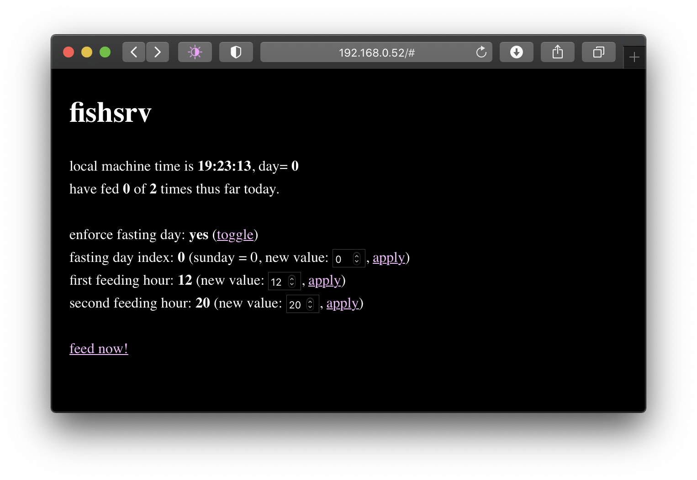

### fishsrv

automatic fish feeder. features:
- uses easily available hardware (espxx, 40x20mm servo, [3d printed assembly](https://www.thingiverse.com/thing:2539750))
- accurate (encoder-based servo will handle resistance gracefully)
- power loss recovery (reads time on startup, continues schedule based on number of times fed)
- web server for manual feeding / monitoring state
- backup strategy if network connection is not available

I used an esp32, as the two esp8266 I had lying around were dead / faultling. This could very easily ported to run 
on esp8266, and it would be less wasteful - not using the BLE/BT functionality of the esp32 for anything here. That
said, preferences.h is a lot nicer to work with than eeprom.h for persistent storage.

Fill in your wifi credentials in src/main.cpp. After doing so, you can configure the feeder from a web interface.
The IP address is logged to the serial port when the microcontroller starts up.

